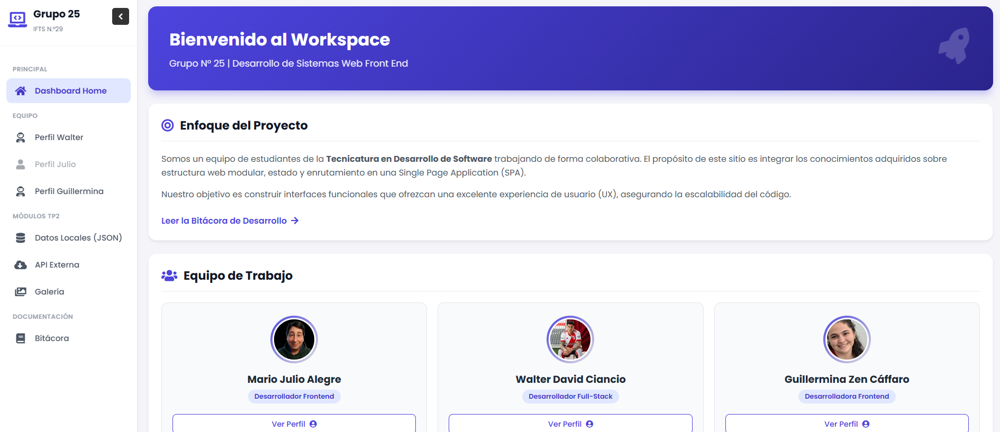
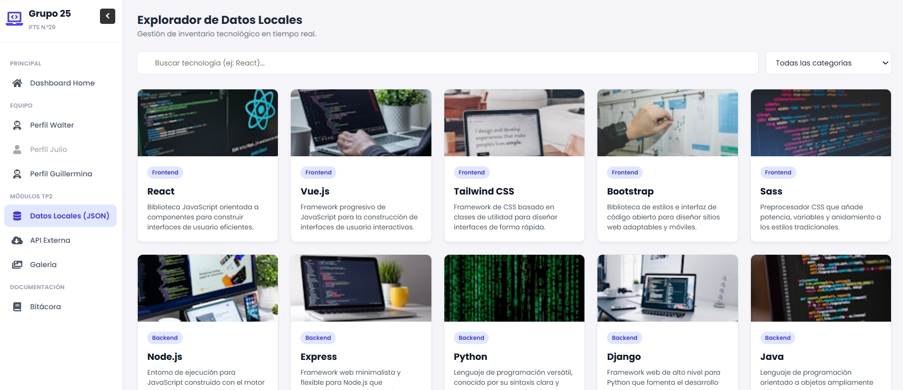
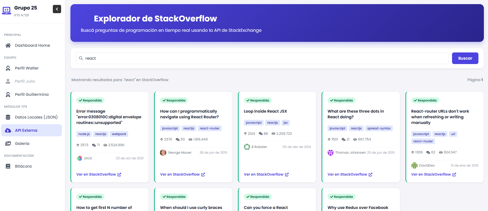
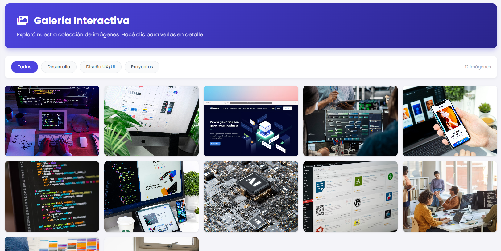

# 🖥️ Grupo N°25 — TP2 React | IFTS N°29

> 🔗 **Deploy en Vercel:** https://tp2-grupal.vercel.app  
> 📁 **Repositorio:** [github.com/walter30ciancio/tp2-grupal](https://github.com/walter30ciancio/tp2-grupal)

---

## 📋 Descripción

Este proyecto es la evolución del Trabajo Práctico 1, migrado de HTML/CSS/JS puro a una arquitectura de componentes con **React**. Es una **Single Page Application (SPA)** estilo dashboard que presenta al equipo del Grupo N°25, con perfiles individuales, exploración de datos, integración de API externa y galería interactiva.

**Funcionalidades principales:**
- Navegación mediante Sidebar fija con React Router
- Perfiles individuales con habilidades, proyectos y redes sociales
- Explorador de datos JSON con búsqueda y filtrado en tiempo real
- Integración con la API pública de StackOverflow con paginación
- Galería de imágenes interactiva con Lightbox y navegación por teclado
- Bitácora del proyecto con cronología, roles del equipo y árbol de renderizado

---

## 👥 Integrantes

| Nombre | Rol | GitHub |
|--------|-----|--------|
| Walter David Ciancio | Arquitectura Base, Navegación y Perfil 1 | [@walter30ciancio](https://github.com/walter30ciancio) |
| Julio Alegre | Panel Central, Datos Locales y Perfil 2 | [@JulioAlegre-dev](https://github.com/JulioAlegre-dev) |
| Guillermina Zen Cáffaro | Integración API, Galería y Perfil 3 | [@guillecaffaro](https://github.com/guillecaffaro) |

---

## 🛠️ Tecnologías Utilizadas

| Tecnología | Uso |
|------------|-----|
| React 18 | Framework principal (componentes, hooks, estado) |
| React Router DOM | Navegación SPA entre páginas |
| Vite | Bundler y servidor de desarrollo |
| HTML5 | Estructura semántica |
| CSS3 | Estilos, animaciones y diseño responsive |
| JavaScript ES6+ | Lógica, async/await, arrow functions |
| Font Awesome 5 | Iconografía (via CDN) |
| StackExchange API | API pública de StackOverflow |
| Picsum Photos | Imágenes placeholder para la galería |
| Git + GitHub | Control de versiones y repositorio |
| Vercel | Deploy y publicación |

---

## 📁 Estructura de Archivos

```
tp2-grupal/
├── public/
│   └── img/
│       ├── capturas/           # Capturas de pantallas
│       ├── conocenos/          # Fotos de perfil de cada integrante
│       └── galeria/            # Imágenes de la galería interactiva
├── src/
│   ├── assets/
│   │   ├── WalterProfile.css   # Estilos compartidos de perfiles
│   │   ├── GuilleProfile.css   # Estilos específicos de Guillermina
│   │   └── JulioProfile.css    # Estilos específicos de Julio
│   ├── components/
│   │   ├── layout/
│   │   │   ├── Layout.jsx      # Contenedor principal de la app
│   │   │   ├── Sidebar.jsx     # Navegación lateral fija
│   │   │   └── Sidebar.css
│   │   └── profile/
│   │       ├── ProgressBar.jsx     # Barra de progreso reutilizable
│   │       ├── ProjectCarousel.jsx # Carrusel de proyectos
│   │       └── SocialButton.jsx    # Botones de redes sociales
│   ├── data/
│   │   ├── localData.json          # Base de datos local en formato JSON para el explorador
│   ├── pages/
│   │   ├── DashboardHome.jsx   # Página principal con grilla de tarjetas
│   │   ├── DashboardHome.css   # Estilos específicos del Dashboard principal
│   │   ├── PerfilWalter.jsx    # Perfil de Walter
│   │   ├── PerfilJulio.jsx     # Perfil de Julio
│   │   ├── PerfilGuille.jsx    # Perfil de Guillermina
│   │   ├── DataExplorer.jsx    # Explorador de datos JSON
│   │   ├── DataExplorer.css    # Estilos específicos del explorador de datos
│   │   ├── ApiIntegration.jsx  # Módulo de API StackOverflow
│   │   ├── ApiIntegration.css
│   │   ├── Galeria.jsx         # Galería interactiva con Lightbox
│   │   ├── Galeria.css
│   │   ├── Bitacora.jsx        # Bitácora y árbol de renderizado
│   │   └── Bitacora.css
│   ├── App.jsx                 # Componente raíz y configuración de rutas
│   └── main.jsx                # Punto de entrada de la aplicación
│   └── index.css
├── index.html
├── package.json
├── vite.config.js
└── README.md
```

---

## 🎨 Guía de Estilos

### Paleta de Colores

| Color | Hex | Uso |
|-------|-----|-----|
| Azul Principal | `#4d44df` | Color primario, botones, activos |
| Azul Oscuro | `#2a248c` | Gradientes, hover |
| Azul Claro | `#e0e7ff` | Fondos de items activos |
| Gris Oscuro | `#1f2937` | Texto principal |
| Gris Medio | `#6b7280` | Texto secundario |
| Gris Claro | `#f9fafb` | Fondos de secciones |
| Blanco | `#ffffff` | Fondos de cards |
| Verde | `#10b981` | Badges respondidas, éxito |
| Amarillo | `#f59e0b` | Badges sin respuesta, advertencia |
| Rojo | `#ef4444` | Estados de error |

### Tipografía

El proyecto utiliza Poppins como tipografía principal en toda la aplicación, cargada desde Google Fonts. Se importan los pesos 400 (regular), 500 (medium), 600 (semibold) y 700 (bold) para cubrir todos los niveles de jerarquía visual.
🔗 Poppins en Google Fonts

### Iconografía

- **Font Awesome 5.15.4** — cargado via CDN en `index.html`
- Documentación: [fontawesome.com](https://fontawesome.com)
- Clases utilizadas: `fab` (marcas), `fas` (sólidos)

---

## ⚛️ JavaScript / React — Funciones y Componentes Clave

### Componentes Globales

| Componente | Descripción |
|------------|-------------|
| `App.jsx` | Configura BrowserRouter y todas las rutas de la SPA |
| `Layout.jsx` | Contenedor principal: Sidebar + Outlet |
| `Sidebar.jsx` | Navegación lateral fija con colapso y NavLinks activos |

### Componentes Reutilizables

| Componente | Descripción |
|------------|-------------|
| `ProgressBar` | Barra de progreso animada para habilidades. Recibe `skill` y `percentage` como props |
| `ProjectCarousel` | Carrusel manual de proyectos con controles anterior/siguiente |
| `SocialButton` | Botones de redes sociales con efectos hover |

### Funciones Dinámicas por Módulo

**API Externa (`ApiIntegration.jsx`)**
- `useEffect([query, page])` — llama a la API de StackOverflow cada vez que cambia la búsqueda o la página
- `useState` — maneja `questions`, `loading`, `error`, `page`, `hasMore`
- Paginación con `has_more` de la propia API
- Renderizado condicional para estados de carga, error y sin resultados

**Galería (`Galeria.jsx`)**
- `useState(activeIndex)` — controla qué imagen está abierta en el Lightbox (-1 = cerrado)
- `useEffect + addEventListener('keydown')` — cierra con ESC, navega con flechas del teclado
- `e.stopPropagation()` — evita que el clic en la imagen cierre el Lightbox
- Filtrado por categoría con `array.filter()`

**Bitácora (`Bitacora.jsx`)**
- `useState(seccionActiva)` — controla qué tab está visible
- Renderizado condicional con `&&` para mostrar cada sección

---

## 🚀 Enlace al Proyecto Desplegado

> 🔗 **Vercel:** (https://tp2-grupal.vercel.app/)

---

## 📈 Evolución del Proyecto

### TP1 → TP2: Migración a React

El proyecto original (TP1) fue desarrollado con HTML, CSS y JavaScript vanilla, con una página por sección y navegación por recarga completa. El TP2 representa una migración completa a React:

- **Antes:** múltiples archivos `.html` con código duplicado (menú repetido en cada página)
- **Ahora:** SPA con componentes reutilizables, React Router y estado centralizado

### Cambios y Mejoras Implementadas

**Walter — Arquitectura Base, Navegación y Perfil 1**
#### 1. Arquitectura Base y Configuración
- Inicialización del Entorno: Configuración del proyecto utilizando **React + Vite** para optimizar los tiempos de carga y el entorno de desarrollo.
- Estructura de Carpetas: Diseño de una arquitectura modular y escalable, dividiendo responsabilidades en `components`, `pages`, `assets` y `styles`.
- Despliegue en Producción: Configuración del archivo `vercel.json` con reglas de reescritura (`rewrites`) para garantizar el correcto funcionamiento del enrutador de React (SPA) en el entorno de **Vercel**.

#### 2. Sistema de Navegación y Layout Global
- Enrutamiento (React Router DOM): Implementación de la navegación principal del sitio en `App.jsx`, definiendo las rutas para el Dashboard, los perfiles individuales, el explorador de datos y la bitácora.
- Layout Principal: Desarrollo de un componente envolvente que mantiene la estructura visual en todas las vistas.
- Sidebar Moderna y Colapsable: Creación de una barra de navegación lateral interactiva (`Sidebar.jsx`). Se implementó el hook `useState` para permitir que el menú sea retráctil, mejorando la experiencia de usuario (UX) y liberando espacio visual en el panel central.

#### 3. Desarrollo de Perfil 1 (UI/UX)
- Página Personal (`PerfilWalter.jsx`): Maquetación y estilización de una landing page personal con información demográfica, objetivos y enlaces de contacto.
- Componentes Reutilizables: 
  - `ProgressBar.jsx`: Componente dinámico para visualizar el nivel de habilidades.
  - `ProjectCarousel.jsx`: Galería interactiva con estado local para navegar entre proyectos destacados.
- Tech Stack Animado: Integración de íconos vectoriales (FontAwesome) con animaciones CSS (hover, scale, color transitions) para destacar las tecnologías manejadas (HTML5, CSS3, JavaScript, React, Node.js, AWS).

**Julio — Panel Central, Datos Locales y Perfil 2**
- Desarrollo del Perfil Individual con un Tech Stack interactivo mediante variables CSS y componentes de intereses personales.

- Refactorización lógica del componente ProjectCarousel para que sea 100% reutilizable mediante el paso de props, permitiendo que cada integrante muestre sus proyectos específicos con la misma lógica.

- Explorador de Datos JSON: Implementación del panel central para la visualización de datos locales, asegurando la persistencia y el filtrado eficiente de la información.

- Gestión de control de versiones, resolución de conflictos de fusión (merges) durante la integración de las ramas del equipo en el repositorio principal.

- Ajuste de diseño responsive y optimización de UI/UX utilizando unidades relativas (rem).

**Guillermina — Integración API, Galería y Perfil 3**
- Integración con API pública de StackOverflow con búsqueda y paginación
- Galería interactiva con grid, filtros por categoría y Lightbox (ESC + flechas)
- Perfil individual con carrusel de proyectos y tech stack
- Bitácora con cronología, roles del equipo y árbol de renderizado
- README.md completo
- Fuente Poppins aplicada globalmente

### Capturas del Proyecto






---

## 🤖 Uso de Inteligencia Artificial

### Herramientas Utilizadas

| Herramienta | Uso principal |
|-------------|---------------|
| **Claude (Anthropic)** | Generación y debugging de componentes React, lógica de hooks, estructura del proyecto |
| **Gemini (Google)** | Generación de contenido textual, descripciones y revisión de código |

### Uso en Contenido y Código

- **Componentes React:** Claude asistió en la estructura de `ApiIntegration.jsx` (manejo de `useEffect`, estados de carga/error y paginación), `Galeria.jsx` (lógica del Lightbox con `addEventListener` y cleanup del efecto) y `Bitacora.jsx` (sistema de tabs con renderizado condicional).
- **Debugging:** Se usó IA para resolver problemas de CSS (nodos del árbol de renderizado con altura incorrecta, responsive del Lightbox) y conflictos de rutas en React Router.
- **Contenido:** Gemini colaboró en la redacción de las descripciones de la Bitácora y la justificación de migración de HTML/JS a React.

### Imágenes y Avatares

- Las imágenes de perfil de cada integrante fueron elegidas de forma individual, pudiendo ser fotografías personales, avatares o imágenes de referencia.
- Las imágenes de la galería fueron obtenidas de [Unsplash](https://unsplash.com/es) (dominio público, sin atribución requerida).


*Trabajo Práctico Grupal N°2 — Tecnicatura en Desarrollo de Software — IFTS N°29 — 2026*